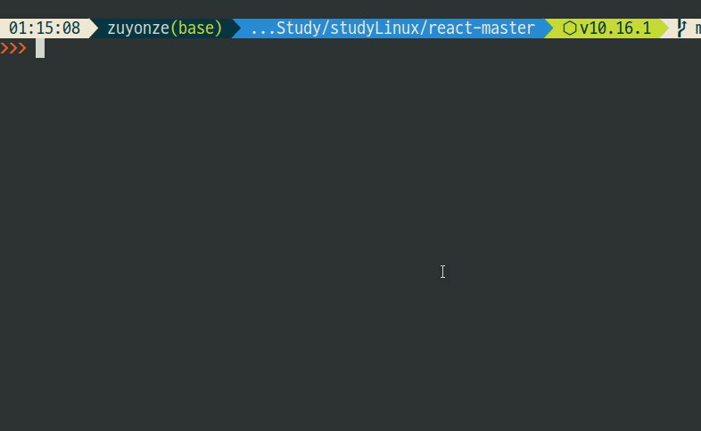

# grep

> **정규표현식**을 이용한 텍스트 검색

* *grep [Pattern] [Filename]*
  * 일반적인 사용법
  * [Filename] 에서 [Pattern] 를 찾는다
  * 기본적으로 Basic regular expression을 사용한다
* *grep **-i** [Pattern]*
  * 대소문자를 무시한다. Ignore Case

## Basic regular expression

* 패턴에서 일부 메타문자를 일반 문자로 인식한다.
  * **ex :** ? , + , { , | , (, )
  * \\ 를 앞에 붙여줘야 비로서 정규표현식 메타문자로 작동한다
    * **ex :** \\?, \\+, \\{ ...
* 굳이 \\를 붙이고 싶지 않다면 아래의 -E 옵션 사용이 가능하다.

## -E 옵션과 -F 옵션의 한 쌍

* *grep **-ie** [Pattern]*
  * 두번째 인자를 정규식 표현으로만 취급한다
  * **-** 가 들어간 문자열을 검색할 때 용이하다
    * **ex :** grep --help | grep -e -e
      * grep --help 문서에서 -e 옵션을 검색한다
* *grep **-Ei** [Extended Regular Expression]*
  * **확장된 정규표현식**에선 메타문자를 굳이 이스케이프하지 않아도 된다.
    * **ex :** grep --help | grep -Ei '\s(-e|-f)'

* *grep **-Fi** '(t|f)est'*
  * 정규식을 사용하지 않고 순수 문자열로 검색

### egrep과 fgrep

* **egrep** 사용시 -E 옵션 생략이 가능하다.
  * **ex :** grep --help | grep -Ei '\s(-e|-f)'
  * **ex :** grep --help | egrep -i '\s-(-e|-f)'
* **fgrep** 사용시 -F 옵션 생략이 가능하다.

## 경로 내 파일검색 및 하위 경로 탐색

* *grep [Pattern] ./\**
  * 해당 폴더내 파일들을 검색함
* *grep **-r** [Pattern] ./\**
  * 하위 폴더의 파일들까지 모두 탐색함

## 줄에 대한 정보들

* *grep **-n** [Pattern] ./\**
  * 매칭되는 라인번호를 표시함
* *grep **-c** [Pattern] [Filename]*
  * 해당 패턴이 매칭되는 줄이 총 몇 줄인지 **라인 수**를 출력함.

## 파일 이름 관련

* *grep **-l***
  * 파일 이름만 출력함
* *grep **-h***
  * 파일 이름을 출력하지 않음
* *grep **-H***
  * 파일 이름을 출력함

* *grep **-C[n]** [Pattern] [Filename]*
  * 매칭된 라인 앞뒤로 n개 줄을 표시함.
* *grep **-m[n]** [Pattern] [Filename]*
  * 파일 당 출력 라인수를 제한함.

## 저장된 패턴을 활용

* *grep **-f [Filename]** [Filename]*
  * -f 뒤의 [Filename] 의 내용을 패턴으로 활용해 검색한다.

