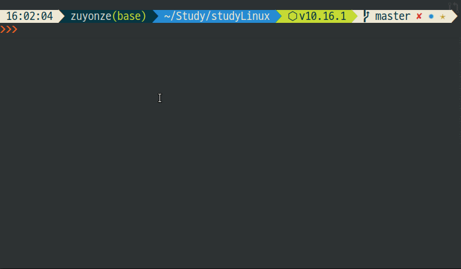
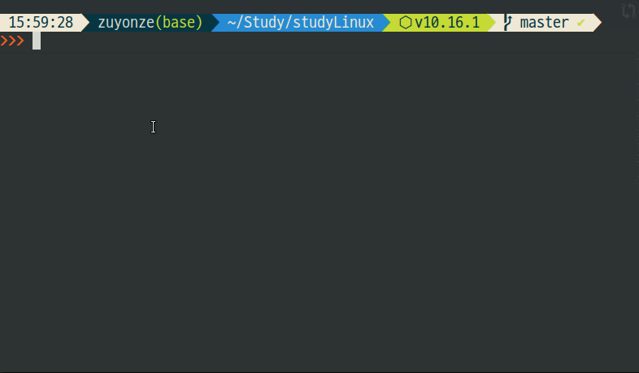
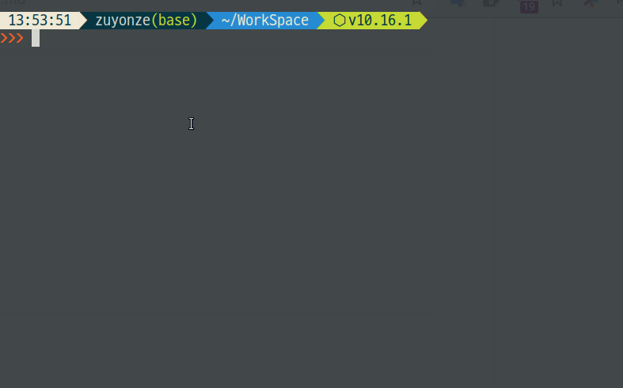
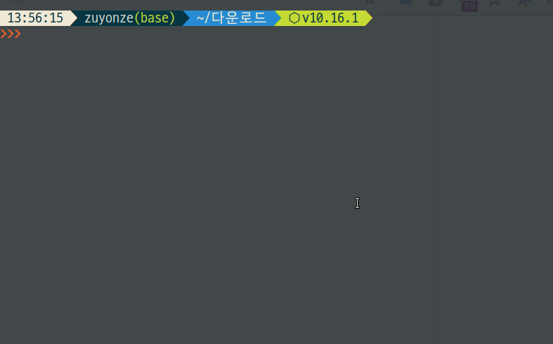

# 시스템 조작

> 시스템 조작 및 간단한 시스템 정보를 조회하는 방법

## shutdown

시스템을 종료하거나 재부팅한다

* *shutdown -h now*
  * 즉시 시스템 종료
* *shutdown -h 15*
  * 15분 뒤 시스템 종료
* *shutdown -h 22:00*
  * 22:00 에 셧다운 예약
* *shutdown -c*
  * 예약된 셧다운 취소
* *shutdown -k +15*
  * 15분 뒤 종료 예정이라고 전 사용자에게 경고
* *shutdown -r*
  * 재부팅

## w, who, whoami, users

접속중인 사용자들에 대한 정보를 조회한다

* *w* 현재 접속한 사용자 목록 출력
* *who* 위와 동일
* *who -b* 시스템 부팅시간 출력
  * UTC로 표기가 되므로, 한국 시간을 알고싶다면 -9시간을 계산해야 된다.
  * **UTC(Universal Time + Coordinated, 협정세계시간)**
  * 한국은 **UTC+9 (UTC에 9시간을 더함)** 를 사용한다.
* *whoami* 현재 로그인된 호스트명 출력
* *users* 접속된 사용자 리스트를 나열

## id

id에 관련된 조회 동작을 실시한다

* *id -un* 현재 호스트명 출력
* *id 1000 -un* uid 1000의 호스트명 출력
* *id -u* 현재 로그인된 계정의 uid 출력

## finger

특정 유저의 이름, 메일, 로그인시간 등의 정보를 확인한다

* *finger -s*
  * 현재 로그인된 계정의 정보를 출력
* *finger -s username*
  * username으로 지정한 유저의 정보를 출력

## md5sum

  특정 파일의 md5 체크섬을 확인

* *md5sum filename* md5 체크섬을 출력.

## df - Disk Free

디스크 사용정보를 출력

* *df **-text4 -hT***
  * **-h** 옵션으로 읽기 쉬운 단위로 출력
  * **-T** 옵션으로 파일시스템 정보를 출력
  * **-t[type]** 옵션으로 해당 파일시스템의 파티션만 필터링

## du - Disk Usage

디스크 사용량을 표시한다

* *du **-hs***
  * **-hs** -> Human Readable, Short
  * 사람이 읽을 수 있게 요약해서 총량만 출력
* *dur **-hsS***
  * **-S**
  * 하위 파일 제외 순수 현재 폴더만의 디스크 사용량 표시

## free - Memory Usage

메모리 사용량을 표시한다

* *free **-hs1***
  * **-s1** 1초에 한 번씩 사용현황을 append
  * **-t** 총 사용량 행을 가장 아래에 출력

