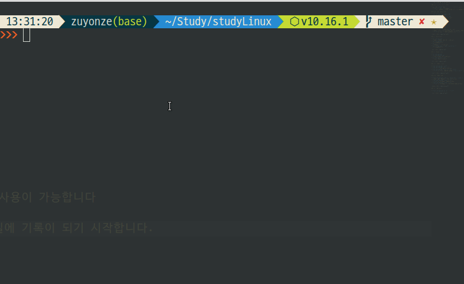
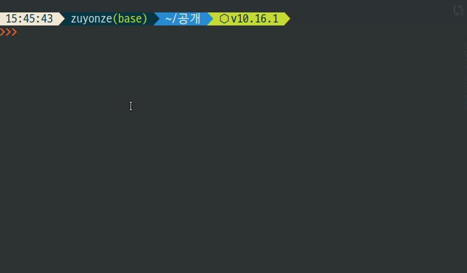
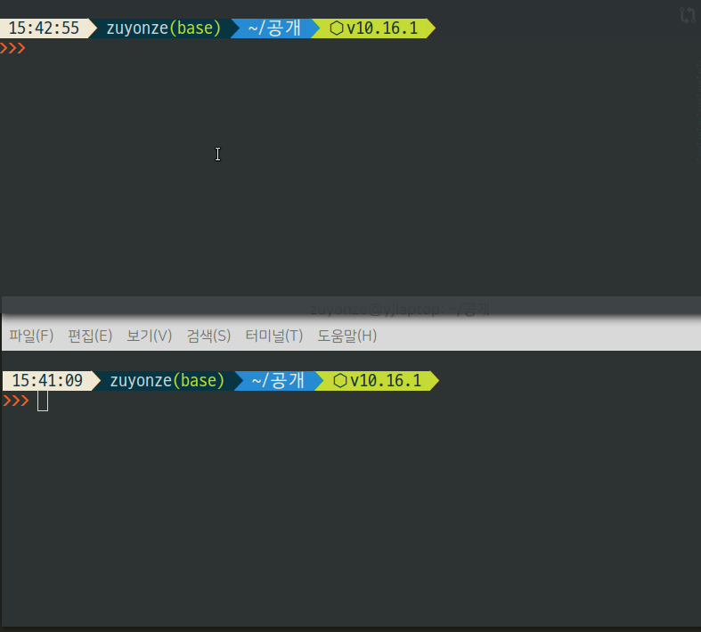
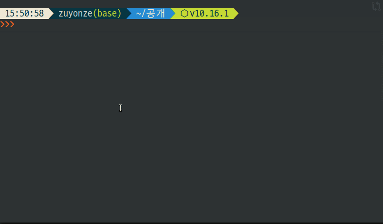
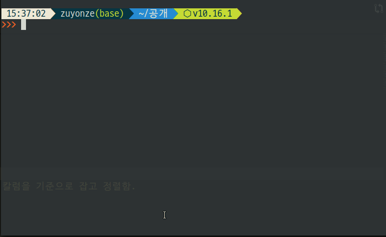
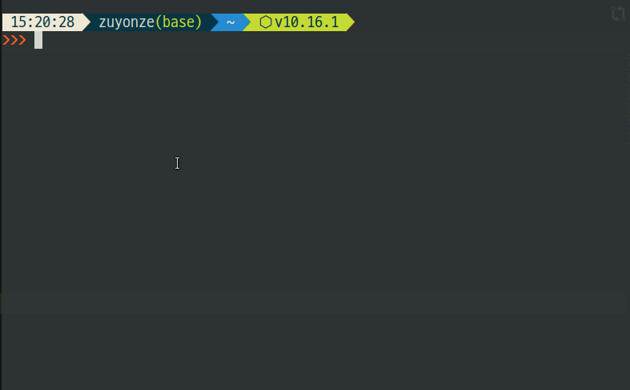

# 텍스트 처리

> 텍스트 처리에 관련된 기능들

## cat 파일의 내용을 출력합니다

* *cat [Filename]*
  * [Filename] 의 내용을 출력합니다
  * *cat [Filename1] [Filename2] ...*
    * 나열된 파일들을 연이어 출력합니다
* *cat **-n** [Filename]*
  * 줄 번호를 붙여서 출력합니다

### cat을 입력도구로 사용하기

* 옵션 없이 **cat** 만을 사용할 경우 입력 도구로 사용이 가능합니다
  * **ex :** *cat > [Filename]*
    * 이후 텍스트를 입력하고 엔터를 치면 해당 파일에 기록이 되기 시작합니다.

## head - 앞 쪽만 보여줘

* *cat /etc/passwd | head -n 50*
  * 위에서 50 라인만 출력.
* *cat /etc/passwd | head -n -50*
  * 아래에서 50 라인 빼고 전부 출력.

## tail - 아래 쪽 보여줘

* 로그 조회하는 용도로 많이 사용.
* *tail /etc/passwd -n 50*
  * 밑에서 50줄만 보여줘.
* *tail /etc/passwd -F*
  * 추가되는 내용을 지속 팔로우하여 출력.
  * 파일이 삭제되었다 다시 생성되어도 re-open하여 계속 팔로우함.
  * **-f** 옵션의 경우 파일 재생성시 팔로우 안 함.

## wc - Word Count

* *wc /etc/passwd*
  * 줄수 / 단어수 / 바이트 카운트 출력.
* *wc /etc/passwd -l*
  * 라인수만 출력함.
* *wc \*.c -l*
  * c파일의 모든 라인수 출력.
* *wc /etc/passwd -l | awk '{ print $1 }'*
  * 라인수만 출력함.

## nl - Number Line

* *nl /etc/passwd*
* *nl /etc/passwd -ba*
  * 공백 라인에도 줄 번호를 출력.
* *nl /etc/passwd -v 10*
  * 번호가 10번부터 시작함.

## sort - 파일을 정렬

* *cat /etc/passwd | sort*
* *cat /etc/passwd | sort -r*
  * **-r** 리버스. 거꾸로 뒤집는다.
* *cat /etc/passwd | sort -t: -k1,1 -k2,2*
  * **-t** 옵션으로 구분자를 정하고, **-k1,1 -k2,2** 옵션으로 첫번째 칼럼과 두번째 칼럼을 기준으로 잡고 정렬함.

## uniq - 중복 제거

* **cat /etc/passwd | awk -F: '{print $1}' | _uniq -i_ | sort -k 2,2 | nl** 
  * 유저 이름을 중복없이 알파벳 순으로 정렬.
* **cat /etc/passwd | uniq -i -d**
  * **-d** 옵션은 중복된 값만 출력한다.
* **cat /etc/passwd | uniq -i -u**
  * **-u** 옵션은 중복되지 않은 유일한 값만 출력한다.

## cut - 잘라내기

* **cat /etc/passwd cut -d':' -f 1,3**

