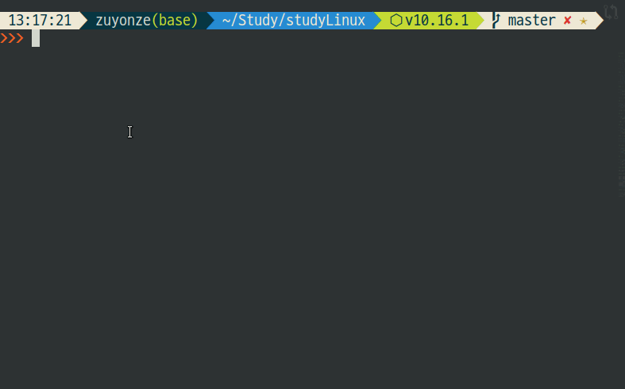
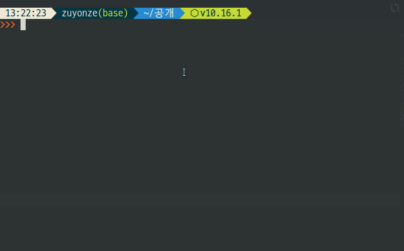
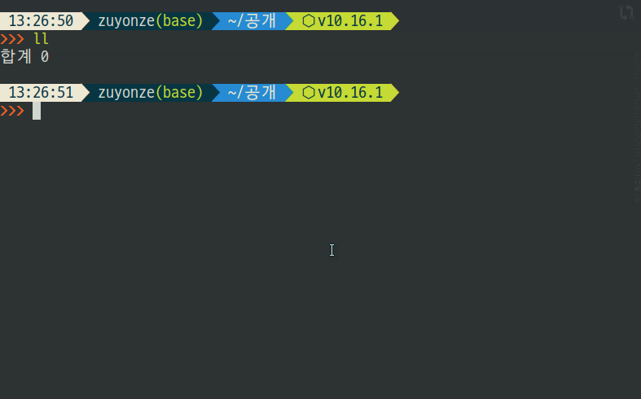

# 파일 처리 관련

> 파일들을 조회하고, 지우고, 잘라내고, 복사하고, 바로가기를 만든다

## ls - List

* *ls -a* 숨김파일 포함해 전체 출력.
* *ls -A* -a 와 동일하되 .와 ..를 제외하고 출력.
* *ls -l* 리스트 형태로 출력.
  * *ls -l (기본값)* 기본적으로 최종 수정시간을 표시한다 (**M**odified)
  * *ls -lc* -l 옵션에서 시간을 최종 변경시간으로 표시 (**C**hanged)
  * *ls -lu* -l 옵션에서 시간을 최종 접근시간으로 표시 (**A**ccess)
* *ls -h* 파일크기를 KB, GB, MB 단위로 알아보기 쉽게 출력. (**H**uman)

### ls - 정렬 관련 옵션

* *ls -t* 시간순으로 정렬
  * *ls -**c**t* 파일을 최종 변경시간 기준으로 정렬 (**C**hanged Time)
  * *ls **-t** (기본값)* 파일을 최종 수정시간 기준으로 정렬 (**M**odified Time)
  * *ls -**ut*** 파일을 최종 접근 시간 기준으로 정렬 (**A**ccess Time)
* *ls -S* 파일 크기 순서대로 정렬
* *ls -r* 역순으로 정렬

### ls - 시간 표기방법 변경

* *ls -lh **--time-style=long-iso***
  * 2019-08-02 와 같은 형태로 출력.
* *ls -lh **--time-style='+%y/%m/%d %H:%M'***
  * 19/08/02 23:31 와 같은 형태로 출력.

## rm - Remove

* *rm -r* 디렉토리 삭제. (**R**ecursive, 반복되는, _재귀적인_)
(**I**nteractive, _반응형_)
* *rm \*.c* c 확장자 파일 다 삭제

## mv - Move

* *mv -b aa bb*
  * aa를 bb로 이동(변경)하는데 bb가 존재할 경우 bb의 백업파일을 생성한다.

## cp - Copy

* *cp ./aa/\* bb*
  * ./aa 안의 모든 파일을 bb 폴더로 옮긴다.
* *cp -p aa bb*
  * aa의 권한, 소유주 정보를 그대로 bb로 복사

### rm mv cp 명령어의 -i -v -f 옵션에 대하여

* **-i** : Interactive, 동작하기 전 사용자에게 재확인
* **-v** : Verbose, 동작한 내용을 출력
* **-f** : Force, 강제로 동작

## mkdir - Make Directory

* *mkdir **-p** ./aa/bb*
  * ./aa 경로가 없을 경우 오류가 출력되나, **-p 옵션**(**P**arents) 사용시 ./aa 생성 후 ./aa/bb 생성함.
* *mkdir **-m** 777 ./aa*
  * **-m** 옵션을 사용해 생성할 디렉토리의 권한을 지정.

## ln - Link

* *ln aa bb*
  * ab라는 이름의 aa를 향한 **하드 링크**를 생성한다.
* *ln -s aa ab*
  * ab라는 이름의 aa를 향한 **심볼릭 링크**를 생성한다.

### 하드링크와 심볼릭 링크

링크에는 하드링크와 심볼릭링크 두 종류가 있다.

#### 하드 링크 Hard Link

원본 파일과 동일한 **Inode**에 링크한다.
원본 파일이 삭제되어도 해당 Inode에 연결된 하드링크 파일이 있다면,
_(해당 파일의 Inode 상 링크수가 0이 아니라면)_
해당 파일의 Inode는 **Free**가 되지 않고
하드링크로 해당 파일에 지속 접근이 가능하다.
하드링크 파일과 원본 파일은 **Inumber**가 동일하다.
**동일한 Inode를 참조하므로 하드링크 생성으로 인해 디스크 공간이 줄어들지 않는다**

#### 심볼릭 링크 Symbolic Link

새로운 Inode를 생성하고,
해당 Inode에는 **원본 파일의 주소**가 기록되어 있다.
당연히, 원본파일이 삭제되거나 경로가 달라지면 더 이상 원본 파일의 내용에 접근이 불가하다.
